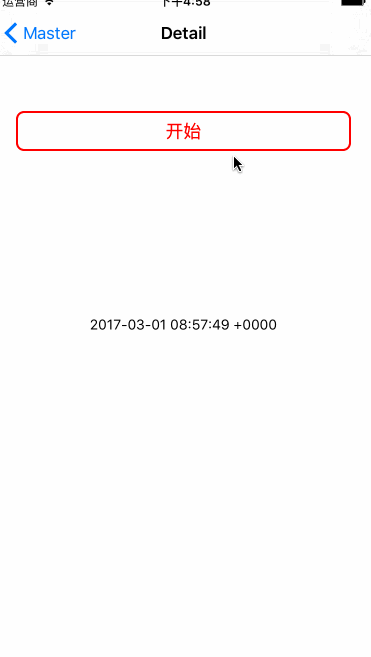

# LYSAlertView
确认框

##效果图

##使用说明

 可以定制化左右按钮的颜色，按下时的颜色，标题的颜色，主体内容的颜色，字体以及控制点击除窗口主体之外的部分是否关闭窗口
 
##属性说明

###pragma mark - 左按钮颜色
@property(nonatomic,strong)UIColor *leftBtnColor;

###pragma mark - 右按钮颜色
@property(nonatomic,strong)UIColor *rightBtnColor;

###pragma mark - 左按钮按下时的颜色
@property(nonatomic,strong)UIColor *leftBtnTintColor;

###pragma mark - 右按钮按下时的颜色
@property(nonatomic,strong)UIColor *rightBtnTintColor;

###pragma mark - 标题颜色
@property(nonatomic,strong)UIColor *titleColor;

###pragma mark - 内容颜色
@property(nonatomic,strong)UIColor *contentColor;

###pragma mark - 按钮字体
@property(nonatomic,strong)UIFont *btnFont;

###pragma mark - 内容字体
@property(nonatomic,strong)UIFont *contentFont;

###pragma mark - 标题字体
@property(nonatomic,strong)UIFont *titleFont;

###pragma mark - 左按钮点击回调
@property(nonatomic,strong)LeftBlock leftBlock;

###pragma mark - 右按钮点击回调
@property(nonatomic,strong)RightBlock rightBlock;

###pragma mark - 分割线的颜色
@property(nonatomic,strong)UIColor *lineColor;

###pragma mark - 点击外层是否关闭窗口 YES-点击窗口主体外 关闭窗体 否则不关闭 默认不关闭
@property(nonatomic,assign)BOOL cancelOnTouchOutside;

##方法

###pragma mark - 初始化方法
- (instancetype)initWithTitle:(NSString*)title content:(NSString*)content leftTitle:(NSString*)leftTitle rightTitle:(NSString*)rightTitle;

###pragma mark - 在targetView显示
-(void)showInView:(UIView*)targetView;

###pragma mark - 关闭窗口
-(void)dismiss;

备注:如果初始化方法中rightTitle不传的话只会出现一个左按钮(可以自己尝试一下哈)
